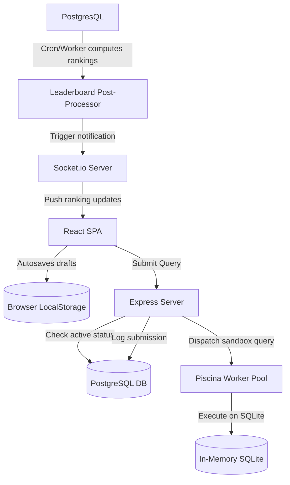

# Timed Contests Feature — Architectural Design & Pathway

This document outlines the architectural plan, prerequisites, design patterns, and phased implementation path for the **Timed Contests (Arena)** feature in Lurner. 

The primary goal of this implementation is **educational excellence**—learning how to build secure, robust, and highly performant full-stack systems, rather than just rushing to put together a minimum viable product.

---

## 1. Feature Specifications & Goals

As defined in the [Contest Requirements](file:///c:/Users/LENOVO/Desktop/LurnerV2/Contest-Requirements.md), the Timed Contests feature simulates a high-pressure interview environment. Unlike real-time multiplayer lobbies, this is a **personal, asynchronous timed challenge** where final rankings are calculated only *after* the contest timeframe finishes.

### Core Objectives
1. **Interactive Contest Solver**: A dedicated multi-question interface with a synchronized countdown timer.
2. **State Resilience**: Local browser state drafts that survive network drops or page reloads.
3. **Session Integrity & Anti-Cheat**: Enforcing focus via browser Fullscreen and Page Visibility APIs.
4. **Strict Server-Side Time Enforcement**: Rejecting late payloads, accounting for network latency.
5. **Optimal Scoring Engine**: Evaluating solutions not just on correctness, but also on query execution speed and AST-based optimal performance, processed asynchronously post-contest.

---

## 2. Architecture & Design Decisions

### Key Decisions for "Good Software"

#### A. Separation of Concerns (Frontend Hooks)
Anti-cheat mechanisms (tab visibility, fullscreen monitoring) and local-draft autosaving are highly stateful. Instead of cluttering the UI component files, we will extract these behaviors into reusable React Custom Hooks:
*   `useFullscreenEnforcer(options)`: Handles entering, exiting, and infraction alerts.
*   `useTabFocusMonitor(onInfraction)`: Monitors the Page Visibility API.
*   `useLocalDraft(contestId, userId)`: Implements debounced auto-saving to `localStorage`.

#### B. Transactions and Concurrency Safety
During contest submissions:
1. We must verify participant status, contest status, and previous successes.
2. We must execute the query in the isolated sandbox.
3. We must log the submission and increment the score.
These steps must run inside a **Prisma Database Transaction** (`$transaction`) to guarantee data integrity under high concurrent loads.

#### C. Post-Contest Rankings Processing
Ranking calculations require pulling all submissions, testing their efficiency, sorting, and committing updates. Running this on the main Express event loop will block other HTTP requests.
*   **Decision**: We will isolate the post-contest leaderboard calculations inside a background worker run via **Piscina** or a modular script triggered via an asynchronous task runner once `now > contest.endTime`.

---

## 3. Prerequisites & Existing Infrastructure

Before we build the contest engine, we have the following tools and services ready to use in the codebase:
*   **Prisma Models**: The `Contest`, `ContestQuestion`, `ContestParticipant`, `ContestSubmission`, and `User` relations are already defined in the database schema.
*   **SQL Execution Pool**: The `executeSql` helper in [SqlEngine.js](file:///c:/Users/LENOVO/Desktop/LurnerV2/LurnerBackend/src/services/execution/SqlEngine.js) is fully functional and ready to run queries inside isolated SQLite memory segments.
*   **Live Connection Engine**: Sockets are already configured in [SocketContext.jsx](file:///c:/Users/LENOVO/Desktop/LurnerV2/LurnerBegin/src/context/SocketContext.jsx) to facilitate instant pushes. We can easily register new events like `contest_ended` or `leaderboard_published`.

---

## 4. Phased Implementation Pathway

### Phase 1: Frontend Navigation & Route Setup
*   **Action**: Link the Arena cards on [Contests.jsx](file:///c:/Users/LENOVO/Desktop/LurnerV2/LurnerBegin/src/pages/Contests.jsx) to navigate to a new route: `/editor/contest/:contestId`.
*   **Action**: Create the `ContestWorkspace.jsx` page. It will look similar to the standard SQL editor but will load multiple contest-specific questions side-by-side, displaying a tick mark for solved items.
*   **Learning Value**: Reusability of Monaco components, routing parameter handling in React Router.

### Phase 2: Local Storage Draft Autosave
*   **Action**: Implement `useLocalDraft` hook. Define a debounced save operation (triggered 1.5 seconds after a user stops typing) writing to `lurner_draft_contest_{contest_id}_user_{user_id}`.
*   **Action**: Clear the key only when the contest is finalized or submitted.
*   **Learning Value**: Debouncing, memory cleanup, preventing browser collisions.

### Phase 3: Browser Sandbox Security & Infractions
*   **Action**: Implement `useFullscreenEnforcer` and `useTabFocusMonitor`.
*   **Action**: Create a warning modal overlay. If a tab-switch or exit-fullscreen occurs, increment an infraction strike counter.
*   **Action**: Set a rule (e.g., after 3 strikes, lock the page and auto-submit current progress).
*   **Learning Value**: Working with modern browser APIs (Fullscreen API, Visibility API), managing system events safely in React.

### Phase 4: Server Time Validation & Late-Submission Rejection
*   **Action**: Refactor [contest.controller.js](file:///c:/Users/LENOVO/Desktop/LurnerV2/LurnerBackend/src/modules/contests/contest.controller.js) submit handler to ensure the submission timestamp is rigorously compared against the DB contest end time.
*   **Action**: Implement a 3-second grace buffer to handle network latency on the final submission payload.
*   **Learning Value**: Timezone handling in databases, network latency mitigation, defensive programming.

### Phase 5: Scoring, Rank Calculations, and Notifications
*   **Action**: Create the `RankEngine` module. Write an optimality algorithm comparing query execution time ($T_{exec}$) and complexity metrics (such as the number of operations or indices utilized).
*   **Action**: Integrate Socket.io to push a `contest_ended` status, forcing a refresh to display the leaderboard.
*   **Learning Value**: Database performance analysis, designing scoring formulas, push notifications.

---

## 5. Architectural Suggestions & Improvements

*   **Ast Diagnostics Enrichment**: The current `compareQueries` diagnostics is marked as "useless" in [diagnostic.service.js](file:///c:/Users/LENOVO/Desktop/LurnerV2/LurnerBackend/src/modules/diagnostic/diagnostic.service.js). Since our goal is deep learning, we should upgrade this parser to detect **sub-optimal query paths** (e.g., using `WHERE` vs `HAVING` inappropriately, or selecting unnecessary fields in subqueries) and use this data to calculate the query's **Optimality Score**.
*   **Virtual Database Refresh**: Ensure that when a contest question executes, it runs on clean database instances isolated per user attempt to prevent previous session inserts/updates from leaking.
